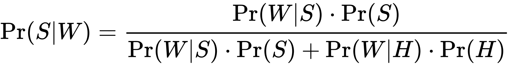
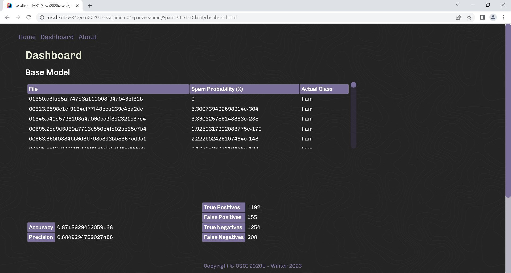
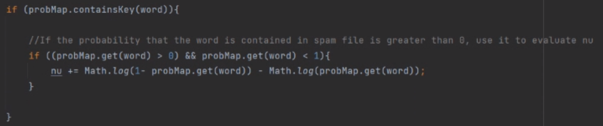

## readme.md

### Project Information
Assignment 1 is a spam detection dashboard that takes given email files with the knowledge of which are spam and which are ham, and creates a probability map for the chances of each file being spam or ham based on the occurance of a word relative to how common that word is in both the ham and spam files. 

This probability is calculated with the standard Bayes spam filtering equation.

Where:
- Pr(S|W) is the probability that a message is a spam, knowing that the word "replica" is in it;
- Pr(S) is the overall probability that any given message is spam;
- Pr(W|S) is the probability that the word "replica" appears in spam messages
- Pr(H) is the overall probability that any given message is not spam (is "ham");
- Pr(W|H) is the probability that the word "replica" appears in ham messages.

&nbsp;

This data is then exported as a json file and appened to tables for our dashboard.

The data is split into three tables for readability. Those being the main formatted json file tabulated, a table of the accuracy and precision percentages, and a table for the numbers of correct and false guesses for both spam and ham files. With percentages being represented in their integer value.

&nbsp;

&nbsp;

### Improvements
There were many improvments to the interface. We ended up creating our own .css file as the provided one was too populated with unecessary code for our websites vision. We utilized keyframing and implemented a 'fade in' animation for many elements, we also used a background image and custom scrollbar to keep the websites theme intact with help from w3Schools documentation. In order to get this model to run when there is a 0% or 100% probability for a word, we added a conidition as taking the log of either of these numbers isn't possible. 

&nbsp;

Also, we tried writing the code as effciently as possible by making sure each of each of the wordmaps had the same value and a few other minor changes. This resulted in having a base precision and accuracy notably higher than the assignment examples.

&nbsp;

&nbsp;

### How To Run
1. Clone this repository into your desired folder.
2. Launch this repository in intelliJ with administrator privileges.
3. Add a configuration to open a local GlassFish server with OpenJDK and deploy the exploaded artifact with the 'play' button.
4. Launch any .html page through intelliJ by running it as the current file, which is in the same drop down as the GlassFish configuration, then hit the 'play' button.
5. Navigate to dashboard.html by selecting dashboard with the navigation bar in the header on each page (if not their already).

&nbsp;

&nbsp;

### Resources
[Wikipedia](https://en.wikipedia.org/wiki/Naive_Bayes_spam_filtering)
- Filter equation photo and explanation

[w3Schools](https://www.w3schools.com/)
- General css documentation

[Coolors](https://coolors.co/)
- Colour pallette help

[TopTal](https://www.toptal.com/designers/subtlepatterns/cartographer/)
- Website background image

[webtoolkit](https://www.webtoolkit.eu/wt)
- Scrollbar manipulation